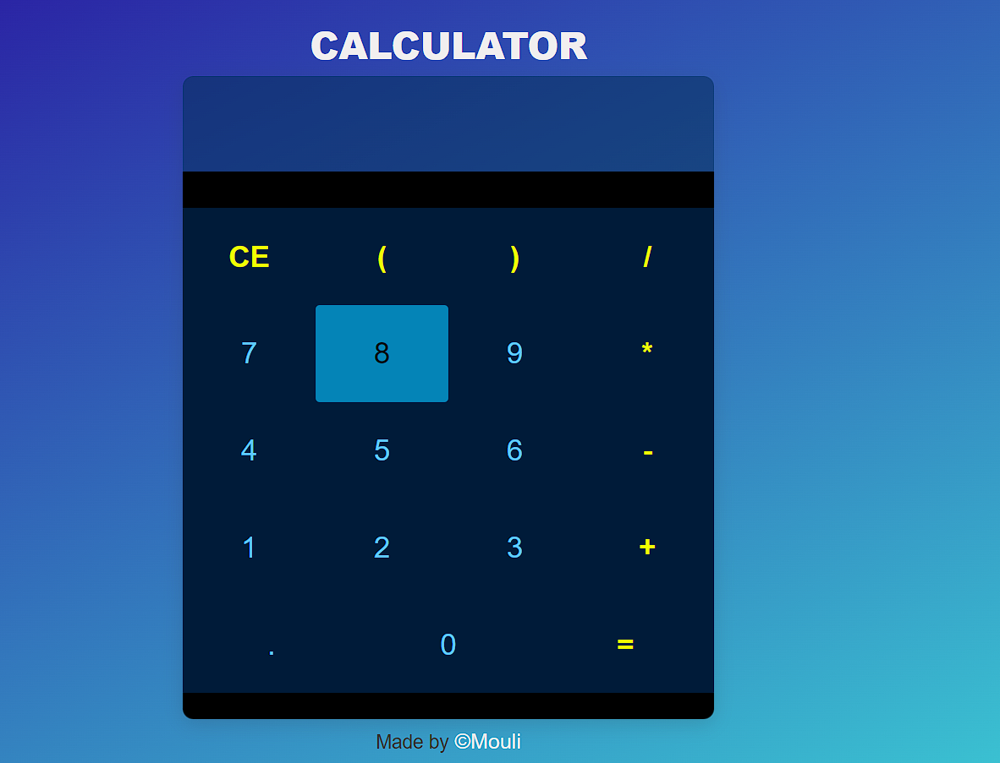

# Simple Calculator

This is a simple calculator web application that allows users to perform basic arithmetic operations such as addition, subtraction, multiplication, and division.

## Features

- User-friendly interface with buttons for numbers (0-9) and operators (+, -, *, /).
- Calculation result displayed in real-time.
- Error handling: the calculator can handle invalid expressions and display an error message.

## Usage

1. Open the `index.html` file in a web browser.
2. Use the mouse to click on the buttons to input numbers and operators.
3. The result of the calculation will be displayed in the input field.
4. Press the `AC` button to clear the input field and start a new calculation.

## Technologies Used

- HTML: Markup language for creating the structure of the web page.
- CSS: Styling language for designing the appearance of the calculator.
- JavaScript: Programming language for implementing the calculator logic and user interactions.
- jQuery: JavaScript library used for DOM manipulation and event handling.